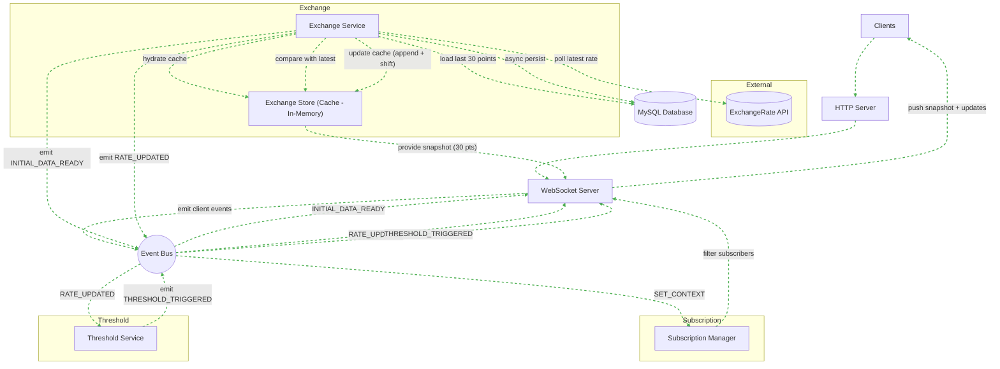

1. <span style="display:flex; text-align:center; justify-content:center">Currency Exchange Rate Graph Web App</span>
==========================

- [1. Concept](#1-concept)
- [2. Event Type](#2-event-type)
- [3. Tech stack (free \& self-contained)](#3-tech-stack-free--self-contained)
- [4. Extras / fun ideas](#4-extras--fun-ideas)
- [5. APIs](#5-apis)
- [6. System Architecture](#6-system-architecture)
- [7. Caching Strategy](#7-caching-strategy)
  - [7.1. Overview](#71-overview)
  - [7.2. Cache Initialization and Hydration](#72-cache-initialization-and-hydration)
  - [7.3. Polling and Real-Time Updates](#73-polling-and-real-time-updates)
  - [7.4. Event-Driven Data Distribution](#74-event-driven-data-distribution)
  - [7.5. Summary of Cache Benefits](#75-summary-of-cache-benefits)
- [8. System Entities](#8-system-entities)


# 1. Concept

**Goal:** Track and visualize currency exchange rate changes between countries in real time.

**Event-driven flavor:** Each rate update is an event, and the system reacts by updating the graph or triggering analytics (like spikes, alerts, or trends).

# 2. Event Type

Read-heavy event-driven: You mostly react to incoming updates.
* Events examples:
  * Rate of USD→EUR updated
  * Rate of JPY→GBP updated
  * Rate crosses a threshold (optional: generate “alert” event)

# 3. Tech stack (free & self-contained)

1. Frontend: React Next.JS + Recharts/D3.js for graphs
2. Backend: Node.js/Express
3. Data source: ExchangeRate-API:
   * 1500 calls/month, but based on the responses sample the resource provided, we have the information of the next new update coming ( [see the response below](#apis) ) 
4. Event handling:
   * WebSocket or Server-Sent Events (SSE) for pushing updates to clients
   * Each API fetch creates an event in your system

# 4. Extras / fun ideas
* Highlight volatility with color-coded graph edges
* Show historical spikes or correlations between currencies
* Let users subscribe to “rate thresholds” (like Slack notifications, but local web alerts)

Explicitely:
  * Subscribe to thresholds:
    *   User sets USD→EUR > 1.05 → alert appears when triggered.
  * Volatility highlights:
    *   Sudden changes → red for sharp drop, green for sharp rise.
  * Multiple currency comparison:
    *   Display 2–3 pairs on same graph, with correlation visualization.
  * Offline mode / demo mode:
    *   Load static JSON to test without hitting APIs.

# 5. APIs

**ExchangeRate-API**
All Supported Currencies

supports all 165 commonly circulating world currencies listed below. These cover 99% of all UN recognized states and territories. But we will work with only these five first: [see more](https://www.exchangerate-api.com/docs/supported-currencies)

```
USD_EUR
USD_GBP
USD_JPY
USD_VND 
USD_SGD 
USD_CNY
USD_RUB
```

Responses;
```
GET https://v6.exchangerate-api.com/v6/YOUR-API-KEY/latest/USD
This will return the exchange rates from your base code to all the other currencies we support:

{
	"result": "success",
	"documentation": "https://www.exchangerate-api.com/docs",
	"terms_of_use": "https://www.exchangerate-api.com/terms",
	"time_last_update_unix": 1585267200,
	"time_last_update_utc": "Fri, 27 Mar 2020 00:00:00 +0000",
	"time_next_update_unix": 1585353700,
	"time_next_update_utc": "Sat, 28 Mar 2020 00:00:00 +0000",
	"base_code": "USD",
	"conversion_rates": {
		"USD": 1,
		"AUD": 1.4817,
		"BGN": 1.7741,
		"CAD": 1.3168,
		"CHF": 0.9774,
		"CNY": 6.9454,
		"EGP": 15.7361,
		"EUR": 0.9013,
		"GBP": 0.7679,
		"...": 7.8536,
		"...": 1.3127,
		"...": 7.4722, etc. etc.
	}
}

Error Responses
{
	"result": "error",
	"error-type": "unknown-code"
}
Where "error-type" can be any of the following:

"unsupported-code" if we don't support the supplied currency code (see supported currencies...).
"malformed-request" when some part of your request doesn't follow the structure shown above.
"invalid-key" when your API key is not valid.
"inactive-account" if your email address wasn't confirmed.
"quota-reached" when your account has reached the the number of requests allowed by your plan.
```

# 6. System Architecture



# 7. Caching Strategy

## 7.1. Overview 

The system implements a hybrid caching strategy designed to balance real-time user updates with persistent storage for historical data. The main goal is to provide users with **up-to-date exchange rate information** while maintaining a **lightweight, high-performance in-memory cache** for rapid access to recent data points. The cache is complemented by a durable MySQL database for long-term storage and historical reference.
<hr />

## 7.2. Cache Initialization and Hydration
Upon the system startup, the Exchange Service queries the database to retrieve the **last 30 historical exchange rate points** for each currency pair. These points are loaded into the **in-memory Exchange Store**, which acts as the cache. Once the cache is hydrated, an **INITIAL_DATA_READY** event is emitted via the **Event Bus** to notify the WebSocket layer that the initial snapshot is available.

This ensures that any user connecting immediately after system startup can receive a **preload graph of the last 30 points**, providing context and continuity without waiting for the next API polling cycle.
<hr />

## 7.3. Polling and Real-Time Updates

The Exchange Service continuously polls the ExchangeRate API for the latest exchange rate data. When a new rate is fetched, it is first **compared against the most recent cached value** to determine if an update is necessary. If a change is detected:
1. The **in-memory cache** is updated using an **append-and-shift strategy**:
   * The new data point is added to the cache.
   * If the cache exceeds 30 points, the oldest point is discarded.
2. A **RATE_UPDATED** event is emitted through the Event Bus to notify all relevant consumers of the change.
3. The update is **asynchronously persisted to the MySQL database** to ensure historical records are maintained without blocking the real-time update path.

This workflow guarantees that the cache remains a **rolling window of the most recent 30 points**, while the database accumulates a complete historical log.
<hr />

## 7.4. Event-Driven Data Distribution

The system leverages an **Event Bus** to propagate changes to multiple subscribers efficiently:
- **WebSocket Server:** Receives both **INITIAL_DATA_READY** and **RATE_UPDATED** events to push the latest snapshot and updates to connected clients.
- **Threshold Service:** Consumers **RATE_UPDATED** events to evaluate user-defined thresholds and emits **THRESHOLD_TRIGGERED** events when necessary.
- **Subscription Manager:** Listens for context-setting events (**SET_CONTEXT**) and filters WebSocket broadcasts to target only relevant subscribers.

By using the cache as the primary source for user-facing data, the system avoids frequent database reads, ensuring low-latency responses even under high load.
<hr />

## 7.5. Summary of Cache Benefits

1. **Immediate User Feedback:** New clients receive a fully hydrated snapshot of the last 30 points on connection.
2. **Efficient Real-Time Updates:** Only incremental changes are appended to the cache and pushed to subscribers.
3. **Durable Persistence:** Historical data is asynchronously persisted, ensuring fault tolerance and long-term analysis.
4. **Event-Driven Architecture:** Decouples data production from consumption, allowing threshold evaluation, subscription filtering, and client updates to scale independently
<hr >

# 8. System Entities

The Currency Exchange Rate Graph Web Application is designed as an event-driven, read-heavy system in which each component operates as a distinct entity with a clearly defined responsibility. Rather than functioning as a traditional request-response pipeline, the system is structured around the continuous production, transformation, and distribution of events. This architectural approach allows the system to maintain real-time responsiveness while preserving historical integrity and scalability.

At the boundary of the system, **Clients** represent the consumers of exchange rate data. These are typically browser-based frontend applications that render graphs and interact with the backend through both HTTP and WebSocket protocols. The **HTTP Server** serves as the initial entry point for client connections, handling standard requests such as application bootstrapping or authentication. Once a persistent communication channel is required, the interaction is upgraded to the **WebSocket Server**, which becomes the primary interface for real-time data exchange. The WebSocket Server is responsible not only for pushing updates to clients but also for translating client actions—such as selecting a currency pair or subscribing to a threshold—into internal system events.

At the core of the architecture lies the **Event Bus**, which acts as the central communication backbone of the system. Contrary to the notion that it passively routes messages based on decisions from the WebSocket layer, the Event Bus operates as an independent pub-sub mechanism. Producers emit events into the bus without knowledge of consumers, and consumers subscribe to only the events relevant to them. This decoupling ensures that components such as data processing, subscription handling, and notification logic can evolve independently without tight coupling. The Event Bus therefore does not “decide” the flow; rather, it enables a reactive ecosystem where each entity determines its own behavior based on the events it receives.

The **Exchange Service** is the primary data producer within the system. It is responsible for interacting with external data sources, specifically the ExchangeRate API, and orchestrating the lifecycle of exchange rate data. Upon system startup, the service retrieves the most recent historical data from the database and initializes the in-memory cache. During runtime, it continuously polls for new exchange rates, compares them with the latest cached values, and determines whether a meaningful update has occurred. When a new data point is validated, the service emits a **RATE_UPDATED** event and asynchronously persists the data to the database. This ensures that real-time updates are not blocked by I/O operations.

Supporting the Exchange Service is the **Exchange Store**, an in-memory cache that maintains a rolling window of the most recent 30 data points for each currency pair. This store is not merely a passive cache but a critical data source for the system’s real-time operations. It enables rapid data retrieval for newly connected clients and ensures that the graph is never empty upon initialization. By implementing an append-and-shift strategy, the store guarantees that only the most relevant and recent data is retained, aligning with the system’s read-heavy requirements.

Persistent storage is handled by the **MySQL Database**, which serves as the system’s durable data layer. While the cache provides fast access to recent data, the database maintains a complete historical record of exchange rates. All writes to the database are performed asynchronously to avoid impacting the responsiveness of the system. This separation of concerns between real-time access and long-term storage is fundamental to the system’s performance and reliability.

The **Subscription Manager** introduces context-awareness into the system. It tracks user-specific interests, such as selected currency pairs or subscribed thresholds, and ensures that only relevant data is delivered to each client. When the WebSocket Server receives a client action (e.g., selecting USD→EUR), it emits a **SET_CONTEXT** event, which the Subscription Manager consumes to update its internal mapping of subscribers. This allows the system to avoid broadcasting unnecessary data, thereby optimizing bandwidth and improving scalability.

Complementing this is the **Threshold Service**, which provides analytical capabilities by monitoring exchange rate changes against user-defined conditions. It subscribes to RATE_UPDATED events and evaluates whether any thresholds have been crossed. When such a condition is met, it emits a **THRESHOLD_TRIGGERED** event back into the Event Bus. This event is then picked up by the WebSocket Server and delivered to the appropriate clients, completing the feedback loop.

The **WebSocket Server**, in its role as both a producer and consumer of events, acts as the bridge between the internal event-driven system and external clients. It listens for events such as **INITIAL_DATA_READY**, **RATE_UPDATED**, and **THRESHOLD_TRIGGERED**, and pushes the corresponding data to connected clients. At the same time, it emits events derived from client interactions into the Event Bus, enabling other services to react accordingly. However, it is important to emphasize that the WebSocket Server does not control the system’s logic or routing decisions; it merely participates in the event ecosystem as one of many entities.

Finally, the **External ExchangeRate API** functions as the upstream data provider. It supplies the raw exchange rate data that fuels the entire system. Given its limitations—such as rate limits and lack of historical data—the system incorporates mechanisms such as initial database seeding and controlled polling to mitigate these constraints.

Finally, the External ExchangeRate API functions as the upstream data provider. It supplies the raw exchange rate data that fuels the entire system. Given its limitations—such as rate limits and lack of historical data—the system incorporates mechanisms such as initial database seeding and controlled polling to mitigate these constraints.