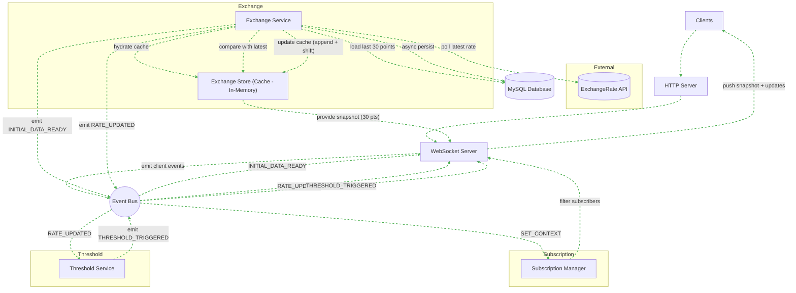

<span style="display:flex; text-align:center; justify-content:center">Currency Exchange Rate Graph Web App</span>
==========================

- [Currency Exchange Rate Graph Web App](#currency-exchange-rate-graph-web-app)
- [Concept](#concept)
- [Event Type](#event-type)
- [Tech stack (free \& self-contained)](#tech-stack-free--self-contained)
- [Extras / fun ideas](#extras--fun-ideas)
- [APIs](#apis)
- [System Architecture](#system-architecture)


# Concept

**Goal:** Track and visualize currency exchange rate changes between countries in real time.

**Event-driven flavor:** Each rate update is an event, and the system reacts by updating the graph or triggering analytics (like spikes, alerts, or trends).

# Event Type

Read-heavy event-driven: You mostly react to incoming updates.
* Events examples:
  * Rate of USD→EUR updated
  * Rate of JPY→GBP updated
  * Rate crosses a threshold (optional: generate “alert” event)

# Tech stack (free & self-contained)

1. Frontend: React Next.JS + Recharts/D3.js for graphs
2. Backend: Node.js/Express
3. Data source: ExchangeRate-API:
   * 1500 calls/month, but based on the responses sample the resource provided, we have the information of the next new update coming ( [see the response below](#apis) ) 
4. Event handling:
   * WebSocket or Server-Sent Events (SSE) for pushing updates to clients
   * Each API fetch creates an event in your system

# Extras / fun ideas
* Highlight volatility with color-coded graph edges
* Show historical spikes or correlations between currencies
* Let users subscribe to “rate thresholds” (like Slack notifications, but local web alerts)

Explicitely:
  * Subscribe to thresholds:
    *   User sets USD→EUR > 1.05 → alert appears when triggered.
  * Volatility highlights:
    *   Sudden changes → red for sharp drop, green for sharp rise.
  * Multiple currency comparison:
    *   Display 2–3 pairs on same graph, with correlation visualization.
  * Offline mode / demo mode:
    *   Load static JSON to test without hitting APIs.

# APIs

**ExchangeRate-API**
All Supported Currencies

supports all 165 commonly circulating world currencies listed below. These cover 99% of all UN recognized states and territories. But we will work with only these five first: [see more](https://www.exchangerate-api.com/docs/supported-currencies)

```
USD_EUR
USD_GBP
USD_JPY
USD_VND 
USD_SGD 
USD_CNY
USD_RUB
```

Responses;
```
GET https://v6.exchangerate-api.com/v6/YOUR-API-KEY/latest/USD
This will return the exchange rates from your base code to all the other currencies we support:

{
	"result": "success",
	"documentation": "https://www.exchangerate-api.com/docs",
	"terms_of_use": "https://www.exchangerate-api.com/terms",
	"time_last_update_unix": 1585267200,
	"time_last_update_utc": "Fri, 27 Mar 2020 00:00:00 +0000",
	"time_next_update_unix": 1585353700,
	"time_next_update_utc": "Sat, 28 Mar 2020 00:00:00 +0000",
	"base_code": "USD",
	"conversion_rates": {
		"USD": 1,
		"AUD": 1.4817,
		"BGN": 1.7741,
		"CAD": 1.3168,
		"CHF": 0.9774,
		"CNY": 6.9454,
		"EGP": 15.7361,
		"EUR": 0.9013,
		"GBP": 0.7679,
		"...": 7.8536,
		"...": 1.3127,
		"...": 7.4722, etc. etc.
	}
}

Error Responses
{
	"result": "error",
	"error-type": "unknown-code"
}
Where "error-type" can be any of the following:

"unsupported-code" if we don't support the supplied currency code (see supported currencies...).
"malformed-request" when some part of your request doesn't follow the structure shown above.
"invalid-key" when your API key is not valid.
"inactive-account" if your email address wasn't confirmed.
"quota-reached" when your account has reached the the number of requests allowed by your plan.
```

# System Architecture

